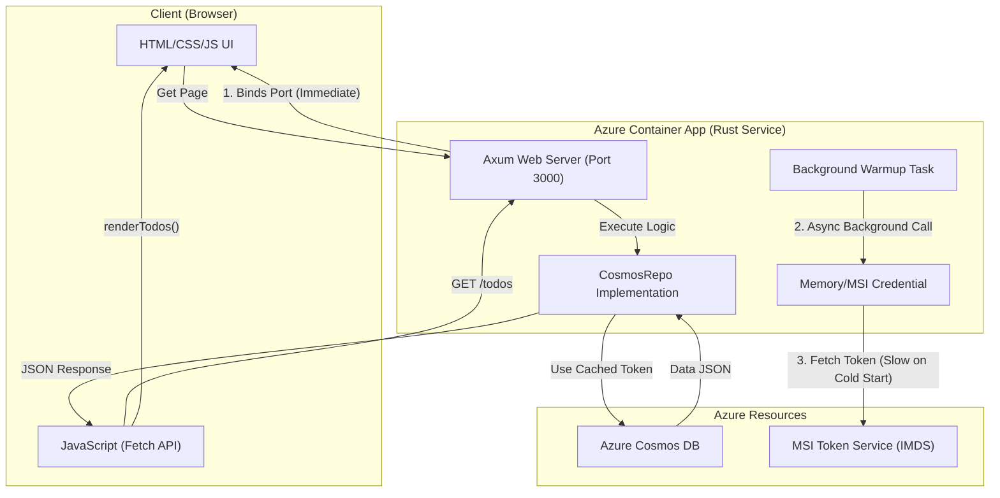

# Walcron Azure Web Server

A high-performance Rust web server built with the Axum framework, serving both the REST API and a lightweight HTML frontend. Optimized for fast Azure Container Apps cold starts with a single native binary. 
Integrated with OTEL

## Features
- **Unified Architecture:**
  - Fast routing and asynchronous execution via **Axum** & **Tokio**.
  - Serves both API and Frontend from a single native binary for minimal cold start (~1s).
  - In-memory data store with thread-safety (`Arc<RwLock<Vec<Todo>>>`) for high concurrency.
  - Ready for OpenTelemetry (OTEL) distributed tracing via `tower-http` with injected request correlation IDs.
  - Minimal (~30MB) footprint production image via a multi-stage Docker build relying on `alpine`.

## Endpoints (Port 3000)
- `GET /` - Serves the HTML UI for the Todo list.
- `GET /todos` - Lists all todos (JSON)
- `POST /todos` - Creates a new todo (requires `{"title": "..."}` JSON payload)
- `PUT /todos/:id` - Updates a todo (requires `{"title": "...", "completed": bool}` JSON payload)

## Getting Started

Assuming you have Rust and Cargo installed, run the server from the root directory:

```bash
cargo run
```

Then you can access the UI at `http://localhost:3000/` or verify the API:
```bash
curl http://localhost:3000/todos
curl -X POST -H "Content-Type: application/json" -d '{"title": "Buy milk"}' http://localhost:3000/todos
```

## Docker Build & Deployment

To package this application for Azure, the CI pipeline automatically builds the container image via `./.github/workflows/docker-build-push.yml`:
1. `walcron-azure:latest` (Unified Backend & Frontend)

**Azure Container Apps Deployment:**
The application is deployed as a single container. Traffic ingress is routed to the Rust application on `port 3000`.

Update standard deployments using:
```bash
./scripts/az-update-container.sh
```

## Flow diagram


