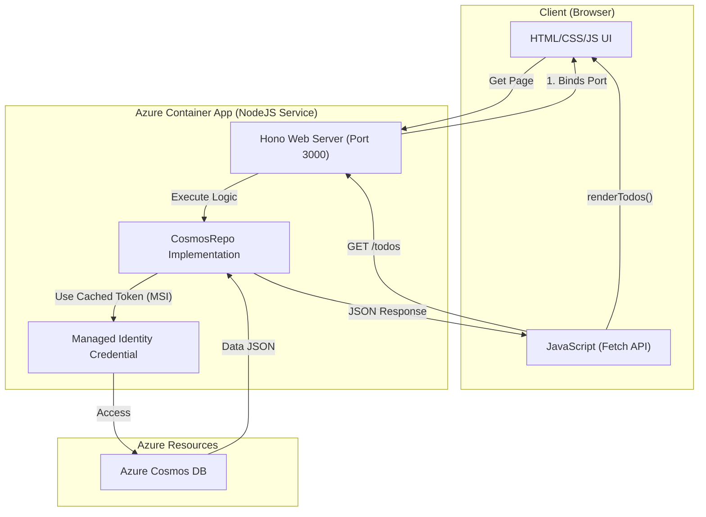

# Walcron Azure Web Server (NodeJS)

A high-performance NodeJS web server built with the Hono framework, serving both the REST API and a lightweight HTML frontend. Optimized for fast Azure Container Apps cold starts using a bundled single JS file and minimal container images.
Integrated with Azure Managed Identities and structured OpenTelemetry (OTEL) logging via Pino.

## Features
- **Unified Architecture:**
  - Fast routing and asynchronous execution via **Hono**.
  - Serves both API and Frontend.
  - CosmosDB data store accessed securely via `@azure/cosmos` with `@azure/identity`.
  - Ready for OpenTelemetry (OTEL) distributed tracing with injected request correlation IDs.
  - Minimal footprint production image via a multi-stage Docker build utilizing `node:20-alpine`.

## Endpoints (Port 3000)
- `GET /` - Serves the HTML UI for the Todo list.
- `GET /healthz` - Health readiness check.
- `GET /todos` - Lists all todos.
- `GET /objectives` - Lists all unique objectives.
- `POST /todos` - Creates a new todo.
- `PUT /todos/:id` - Updates a todo.
- `DELETE /todos/:id?objective=...` - Deletes a todo.

## Getting Started

Assuming you have `Node` installed, run the server from the root directory:

```bash
npm install
npm run dev
```

Then you can access the UI at `http://localhost:3000/`.

**Environment Variables Required:**
```bash
COSMOS_ENDPOINT="https://..."
COSMOS_DATABASE="TodoDatabase"
COSMOS_CONTAINER="Todos"
```

## Docker Build & Deployment

To package this application for Azure, use the included `Dockerfile` which bundles the TypeScript application into a single JavaScript file.

```bash
docker build -t walcron-azure:latest .
```

**Azure Container Apps Deployment:**
The application is deployed as a single container. Traffic ingress is routed to the NodeJS application on `port 3000`.

## Flow diagram


