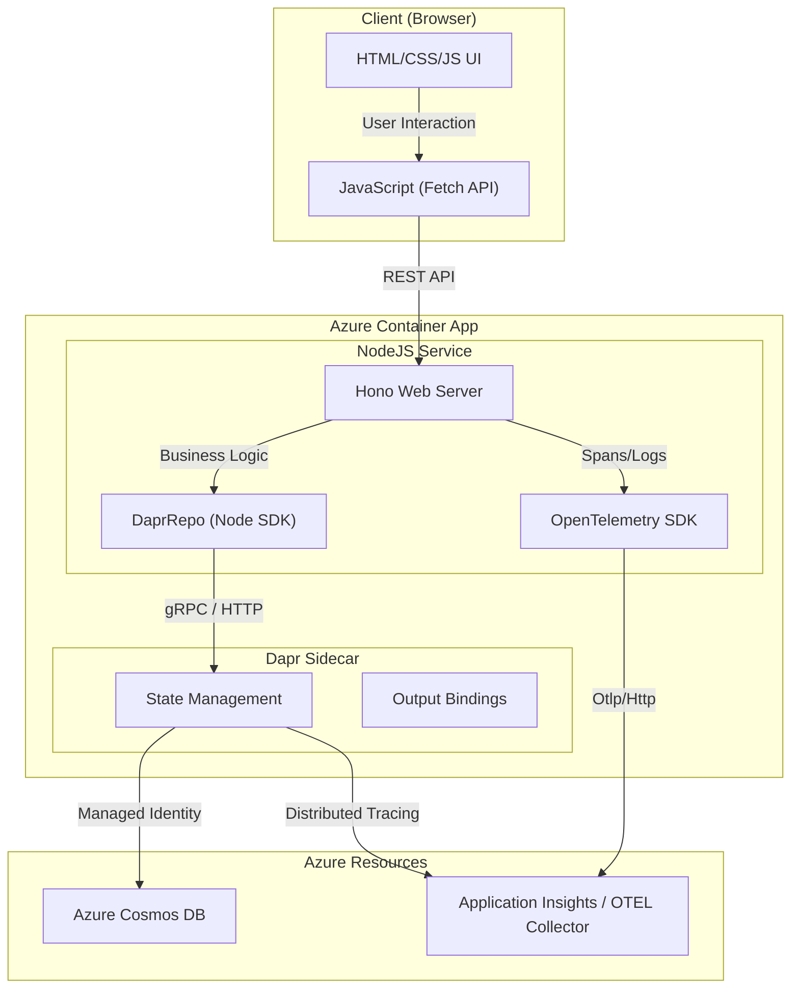

# Walcron Azure Web Server (NodeJS + Dapr)

A high-performance NodeJS web server built with the Hono framework, optimized for Azure Container Apps. The application leverages **Dapr** for state management and **OpenTelemetry** for full-stack observability.

## Features
- **Unified Architecture:**
  - Fast routing and asynchronous execution via **Hono**.
  - **Dapr Sidecar Integration:** Data access to Cosmos DB is abstracted via Dapr State Store and Output Bindings, eliminating direct SDK dependencies.
  - **Partitioning Strategy:** Optimized Cosmos DB partitioning using the `/partitionKey` path, mapped explicitly to business objectives.
- **Observability:**
  - **OpenTelemetry (OTEL):** Full distributed tracing and metrics integration.
  - **Structured Logging:** High-performance logging via **Pino**, correlated with OTEL Trace IDs and exported to Azure Application Insights.
- **Azure Native:**
  - **Managed Identities:** Passwordless authentication for all Azure resources via Dapr.
  - **Fast Cold Starts:** Bundled single-file deployment for rapid scaling in Azure Container Apps.

## Endpoints (Port 3000)
- `GET /` - Serves the HTML UI for the Todo list.
- `GET /healthz` - Health readiness check.
- `GET /todos` - Lists all todos (via Dapr State Query API).
- `GET /objectives` - Lists all unique objectives.
- `POST /todos` - Creates a new todo (via Dapr State Store).
- `PUT /todos/:id` - Updates a todo.
- `DELETE /todos/:id?objective=...` - Deletes a todo.

## Getting Started

### Local Development with Dapr
Ensure you have the [Dapr CLI](https://docs.dapr.io/getting-started/install-dapr-cli/) installed.

1. **Install dependencies:**
   ```bash
   npm install
   ```

2. **Run with Dapr Sidecar:**
   ```bash
   npm run dev
   ```
   This command starts the Hono server and a Dapr sidecar locally, using the components defined in `./components`.

3. **Access the UI:**
   Open `http://localhost:3000/`.

## Deployment

The application is containerized using a multi-stage Docker build and deployed to **Azure Container Apps** with Dapr enabled.

```bash
docker build -t walcron-azure:latest .
```

## Architecture & Flow


